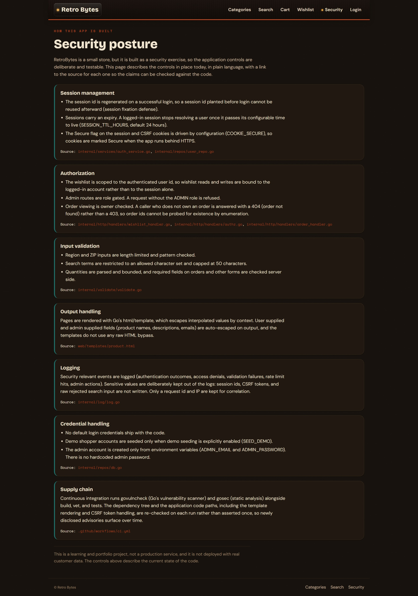
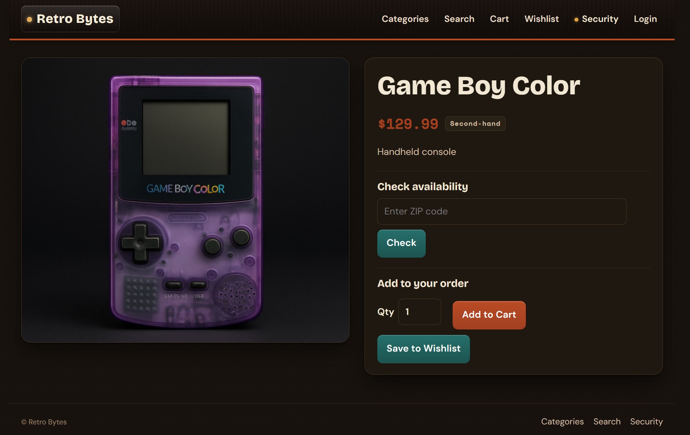
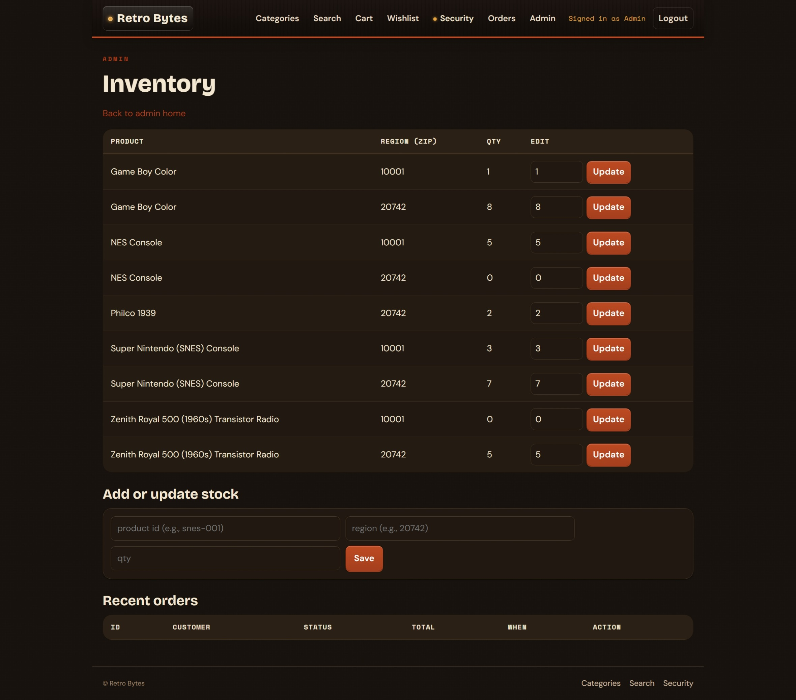

# RetroBytes

[](https://github.com/praneethkoti/RetroBytes/actions/workflows/ci.yml)

A full-stack retro-electronics store engineered through a complete secure development lifecycle: designed, threat-modeled, built, peer-reviewed, hardened, and deployed.

**Live demo: [retrobytes.onrender.com](https://retrobytes.onrender.com/)** | **Security posture: [retrobytes.onrender.com/security](https://retrobytes.onrender.com/security)**

Hosted on a free tier, so the first load after a period of inactivity may take up to a minute to wake.

RetroBytes is a small e-commerce web application for a retro electronics store, built with Go (Fiber v2) and SQLite. It supports browsing categories and products, checking local stock by ZIP, a cart and checkout flow, a per-user wishlist, order history, and an admin area for inventory, orders, and users. The code is organized in layers: domain models, repositories for data access, services for business logic, and HTTP handlers, with bcrypt password hashing and cookie-based sessions.

## Security engineering

Security was part of building this application, not a coat of paint applied afterward. The store was taken through a full secure development lifecycle and then validated by an independent peer review.

### Designed in from the start

Before implementation, the application was specified with requirements and a design (including a traceability matrix mapping requirements to components), then analyzed with STRIDE threat modeling and misuse-case analysis to decide which controls the design needed. The implementation carries those controls:

- **Session management**: the session id is rotated on login (session fixation defense), authenticated sessions expire after a configurable TTL, and the session and CSRF cookie `Secure` flag is driven by configuration for HTTPS deployments.
- **Input validation**: user input is validated server-side (ZIP and region, a character whitelist and length cap on search, quantity bounds, email and name and password rules, id and category checks) rather than trusting the client.
- **Output handling**: pages render through Go's `html/template`, which escapes interpolated values by context; no raw-HTML bypass is used.
- **Logging**: security-relevant events are recorded as structured entries, and sensitive values (session ids, CSRF tokens, and raw rejected search input) are deliberately excluded.
- **Error handling**: failures return generic messages to the client while the detail is logged server-side.
- **Credential handling**: no default login credentials ship with the code; demo accounts seed only when explicitly enabled, and the admin account is created only from environment variables with no hardcoded password.

These are documented in-app on the running site's [security posture page](https://retrobytes.onrender.com/security), where each control links to its source.

### Validated by peer review

The app was then given to an independent reviewer for a secure code review, which raised 9 findings. I verified all 9 against the actual source rather than trusting the report text, then:

- **Fixed 4** confirmed findings (session binding, wishlist authorization, sensitive data in logs, and scoping the wishlist to the authenticated user id rather than the session).
- **Applied 1 defense-in-depth partial**: a page-size cap on search and listing queries. The live route was already bounded, so this hardens a latent path rather than closing an active bug.
- **Dismissed 4 as false positives** with written justification (an alleged order IDOR that already had a correct owner check, an open redirect that redirects to a fixed path, a stored XSS where template auto-escaping is intact, and error-message info exposure where responses are already generic).

Each fix landed as its own commit with a regression test that fails without the change and passes with it. That four of the nine findings were false positives is itself a result: the original design held up under outside scrutiny. The full write-up, including the false-positive justifications and the finding-count reconciliation, is in [documents/RetroBytes - Remediation Summary.md](documents/RetroBytes%20-%20Remediation%20Summary.md).

### Operationalized

Security checks run continuously, not once. CI runs govulncheck and gosec on every push, Dependabot watches the Go and GitHub Actions dependencies, and the deployed app runs with the Secure cookie flag active over HTTPS.

## Screenshots

Storefront, with the security posture surfaced right in the hero.


In-app security posture page: each control documented with a link to its source.



Product detail with availability check and cart and wishlist actions.



Role-gated admin: stock management by region.



## Run it

Requires Go 1.25 or newer (see [go.mod](go.mod), toolchain `go 1.25.3`). The app serves on `http://localhost:8081`.

Configuration is via environment variables:

| Variable | Default | Purpose |
|---|---|---|
| `SEED_DEMO` | unset (off) | Set to `true` to seed four demo user accounts. |
| `ADMIN_EMAIL` | unset | Admin account email. Required (with the password) to seed an admin. |
| `ADMIN_PASSWORD` | unset | Admin account password. There is no hardcoded default. |
| `COOKIE_SECURE` | `false` | Set to `true` behind HTTPS to mark session and CSRF cookies Secure. |
| `SESSION_TTL_HOURS` | `24` | Authenticated session lifetime in hours. |

Example (PowerShell), seeding demo data and an admin for local exploration:

```powershell
$env:SEED_DEMO='true'; $env:ADMIN_EMAIL='admin@retrobytes.test'; $env:ADMIN_PASSWORD='<choose-a-strong-password>'
go run ./cmd/retrobytes
```

With no environment variables set, the app starts with zero user accounts (safe to run publicly). Open `http://localhost:8081/` to browse.

## Tests

```
go test ./...
```

The suite includes security regression tests labeled with `SR-*` ids in the test names and comments, covering authentication and throttling (`SR-AUTH-*`), authorization including session rotation and expiry and wishlist scoping (`SR-AUTHZ-*`), input validation and template escaping (`SR-VAL-*`), logging and the no-secrets-in-logs guarantee (`SR-LOG-*`), rate and body-size limits (`SR-RATE-*`, `SR-SIZE-*`), error handling (`SR-ERR-*`), and opt-in seeding (`SR-CONF-*`).
